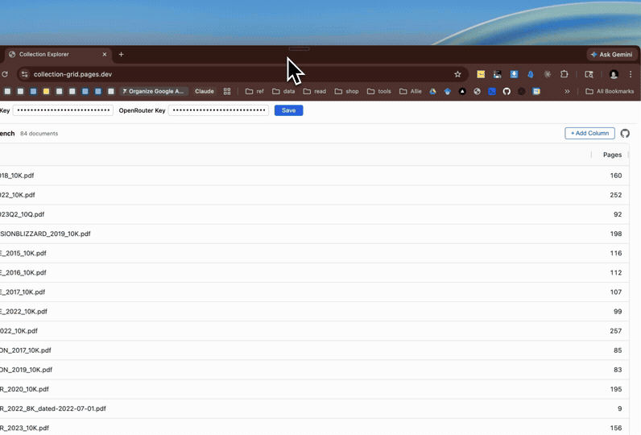

# Collection Grid

Ask questions across every document in an OkraPDF collection and view the answers in a spreadsheet.



## Quick start

```bash
npm install
npm run dev
```

Set your OkraPDF and OpenRouter API keys in the settings panel, then add columns to start extracting.

## Deploy

```bash
npm run deploy
```

Live at [collection-grid.pages.dev](https://collection-grid.pages.dev/)
